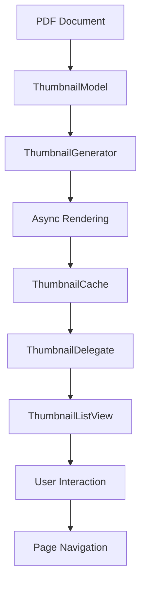

# 缩略图系统文档

## 概述

本项目实现了一个高性能、Chrome 风格的 PDF 缩略图系统，提供流畅的用户体验和优秀的性能表现。

## 核心特性

### 🎨 Chrome 风格设计

- 圆角边框和阴影效果
- 悬停和选中状态动画
- 现代化的视觉设计
- 支持明暗主题

### ⚡ 高性能优化

- 基于 QAbstractListModel 的虚拟滚动
- 智能懒加载机制
- 异步缩略图生成
- 内存使用优化
- 多线程渲染

### 🔧 丰富功能

- 点击跳转页面
- 右键菜单操作
- 键盘导航支持
- 拖拽操作（可选）
- 缓存管理

## 架构设计

### 核心组件

```
ThumbnailSystem
├── ThumbnailWidget          # 单个缩略图组件
├── ThumbnailModel          # 数据模型（虚拟滚动）
├── ThumbnailDelegate       # 渲染委托
├── ThumbnailGenerator      # 异步生成器
├── ThumbnailListView       # 列表容器
├── ThumbnailContextMenu    # 右键菜单
├── ThumbnailAnimations     # 动画管理
├── ThumbnailVirtualizer    # 虚拟滚动优化
├── ThumbnailCacheAdapter   # 缓存适配器
└── ThumbnailPerformanceOptimizer # 性能优化器
```

### 数据流



## 使用方法

### 基础集成

```cpp
// 1. 创建组件
auto thumbnailModel = std::make_unique<ThumbnailModel>(this);
auto thumbnailDelegate = std::make_unique<ThumbnailDelegate>(this);
auto thumbnailView = new ThumbnailListView(this);

// 2. 设置关联
thumbnailView->setThumbnailModel(thumbnailModel.get());
thumbnailView->setThumbnailDelegate(thumbnailDelegate.get());

// 3. 配置文档
std::shared_ptr<Poppler::Document> document = loadPDFDocument(filePath);
thumbnailModel->setDocument(document);

// 4. 连接信号
connect(thumbnailView, &ThumbnailListView::pageClicked,
        this, &MainWindow::onThumbnailPageClicked);
```

### 高级配置

```cpp
// 设置缩略图尺寸
QSize thumbnailSize(150, 200);
thumbnailView->setThumbnailSize(thumbnailSize);
thumbnailModel->setThumbnailSize(thumbnailSize);
thumbnailDelegate->setThumbnailSize(thumbnailSize);

// 配置性能参数
thumbnailModel->setCacheSize(200);           // 缓存200个缩略图
thumbnailModel->setMemoryLimit(512 * 1024 * 1024); // 512MB内存限制
thumbnailModel->setPreloadRange(5);          // 预加载5页

// 配置生成器
auto generator = thumbnailModel->getGenerator();
generator->setMaxConcurrentJobs(4);          // 4个并发任务
generator->setQuality(1.2);                  // 120%质量
```

### 样式自定义

```cpp
// 设置主题
thumbnailDelegate->setLightTheme();  // 亮色主题
// 或
thumbnailDelegate->setDarkTheme();   // 暗色主题

// 自定义颜色
QColor background = QColor(255, 255, 255);
QColor border = QColor(200, 200, 200);
QColor text = QColor(60, 60, 60);
QColor accent = QColor(66, 133, 244);
thumbnailDelegate->setCustomColors(background, border, text, accent);
```

## 性能优化建议

### 内存管理

- 合理设置缓存大小，避免内存溢出
- 使用内存限制功能自动管理缓存
- 定期清理不需要的缓存项

### 渲染优化

- 根据显示需求调整缩略图质量
- 使用预加载提升用户体验
- 限制并发渲染任务数量

### 用户体验

- 启用动画效果提升视觉体验
- 使用懒加载避免界面卡顿
- 提供加载指示器和错误提示

## 故障排除

### 常见问题

**Q: 缩略图显示空白**
A: 检查 PDF 文档是否正确加载，确认 Poppler 库版本兼容性

**Q: 内存使用过高**
A: 调整缓存大小和内存限制，启用自动内存管理

**Q: 加载速度慢**
A: 增加并发任务数，调整预加载范围，检查磁盘 I/O 性能

**Q: 动画不流畅**
A: 检查系统性能，考虑禁用部分动画效果

### 调试信息

启用调试输出：

```cpp
// 在main函数中添加
QLoggingCategory::setFilterRules("thumbnail.*=true");
```

查看性能统计：

```cpp
// 获取缓存统计
int hits = thumbnailModel->cacheHitCount();
int misses = thumbnailModel->cacheMissCount();
qint64 memory = thumbnailModel->currentMemoryUsage();

qDebug() << "Cache hits:" << hits << "misses:" << misses
         << "memory:" << memory / 1024 / 1024 << "MB";
```

## API 参考

### ThumbnailModel

主要的数据模型类，负责管理缩略图数据和缓存。

**关键方法：**

- `setDocument()` - 设置 PDF 文档
- `setThumbnailSize()` - 设置缩略图尺寸
- `setCacheSize()` - 设置缓存大小
- `requestThumbnail()` - 请求生成缩略图

### ThumbnailListView

主要的视图组件，提供用户交互界面。

**关键方法：**

- `setThumbnailModel()` - 设置数据模型
- `scrollToPage()` - 滚动到指定页面
- `setCurrentPage()` - 设置当前页面

### ThumbnailDelegate

渲染委托，负责缩略图的视觉效果。

**关键方法：**

- `setThumbnailSize()` - 设置渲染尺寸
- `setLightTheme()` / `setDarkTheme()` - 设置主题
- `setAnimationEnabled()` - 启用/禁用动画

## 扩展开发

### 添加自定义动作

```cpp
// 创建自定义右键菜单动作
QAction* customAction = new QAction("自定义操作", this);
connect(customAction, &QAction::triggered, [this]() {
    // 自定义逻辑
});

// 添加到右键菜单
thumbnailView->addContextMenuAction(customAction);
```

### 自定义渲染效果

```cpp
// 继承ThumbnailDelegate实现自定义渲染
class CustomThumbnailDelegate : public ThumbnailDelegate {
protected:
    void paint(QPainter* painter, const QStyleOptionViewItem& option,
               const QModelIndex& index) const override {
        // 自定义绘制逻辑
        ThumbnailDelegate::paint(painter, option, index);

        // 添加额外效果
        // ...
    }
};
```

## 版本历史

- **v1.0.0** - 初始版本，基础缩略图功能
- **v1.1.0** - 添加 Chrome 风格设计和动画效果
- **v1.2.0** - 性能优化和虚拟滚动
- **v1.3.0** - 右键菜单和交互功能

## 许可证

本缩略图系统遵循项目的整体许可证协议。
